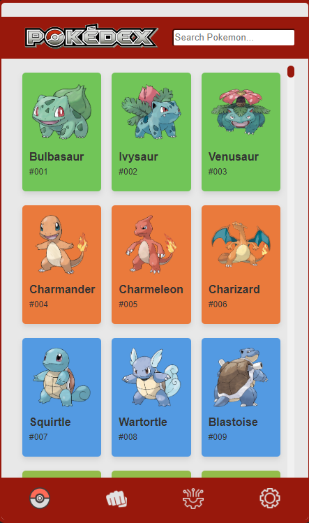
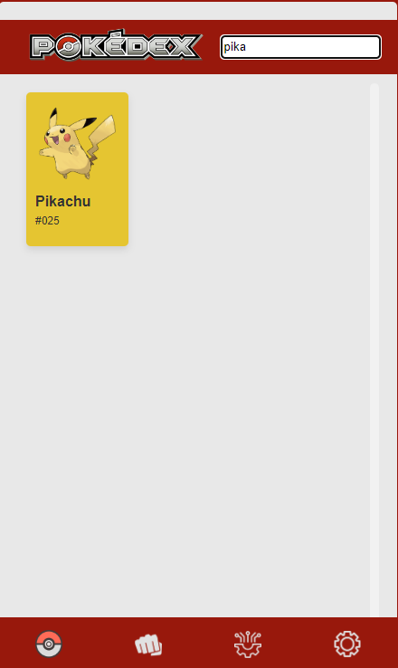
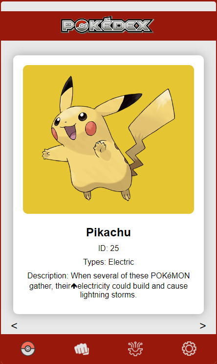
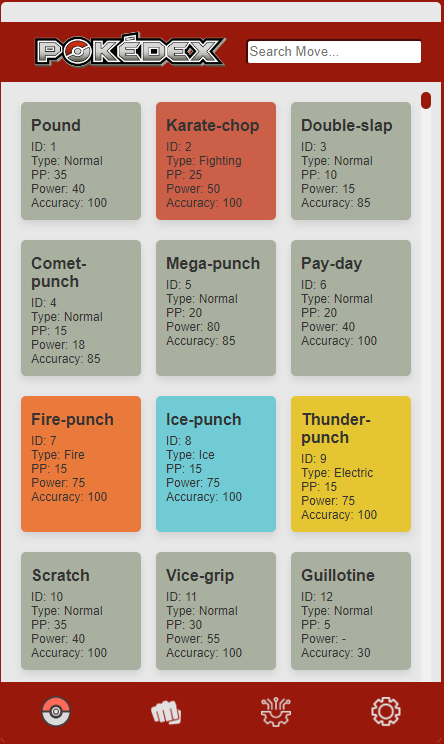
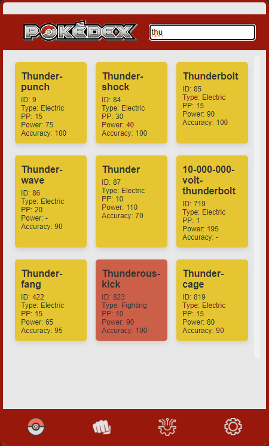
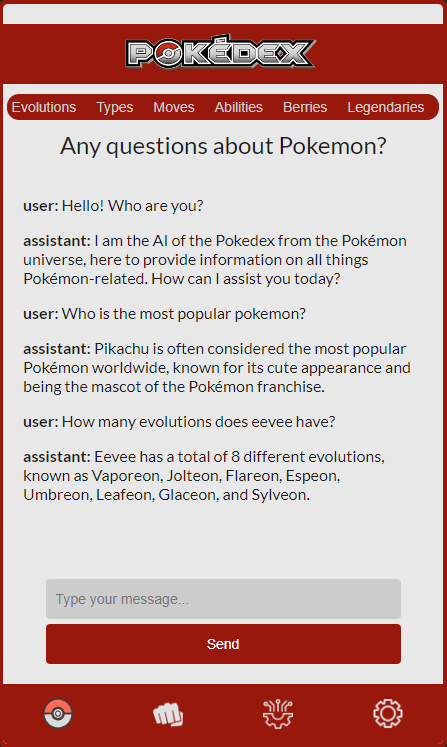

# Pokedex Application

Welcome to the Pokedex Application. The purpose of this Pokedex is to view detailed information about each Pokemon (All 1025 Pokemons) (including their image, name, and ID number). You can also search for a Pokemon's name using the search bar. You can also search for Pokemon Moves (All 844 Moves). There is also an AI Chatbot Avaiable that knows everything about Pokemon. Finally, the Wiki section that includes a lot of important links for pokemon stuff.

## App preview

<table>
  <tr>
    <td></td>
    <td></td>
    <td></td>
  </tr>
  <tr>
    <td></td>
    <td></td>
    <td></td>
  </tr>
  <tr>
    <td></td>
    <!-- Add more screenshots here if needed -->
  </tr>
</table>

## Flutter Installation

- Add [Flutter](https://flutter.dev/docs/get-started/install) to your machine
- Open this project folder with Terminal/CMD and run `flutter packages get`
- Run `flutter run` to build and run the debug app on your emulator/phone

## Web Installation
- Open the "Website" Folder.
- Run the Index.html file

## Features

- Browse through a collection of Pokemon.
- View detailed information about each Pokemon, including their image, name, and ID number.
- Search for specific Pokemon using the search bar.
- Access useful Pokemon-related resources such as the official Pokemon Pokedex, Pokemon Database, and more.
- Responsive design: works seamlessly on desktop, tablet, and mobile devices.

## API

- This project utilizes the PokeAPI (https://pokeapi.co/) for retrieving Pokemon data.
- This project utilizes the OpenAI API (https://platform.openai.com/overview) for the AI Chatbot.
