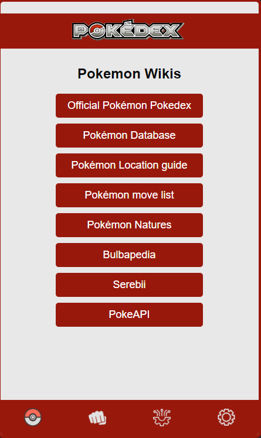

# Pokedex Application

Welcome to the Pokedex Application, where you can dive into the world of Pokemon with ease. Discover detailed profiles of all 1025 Pokemon, complete with images, names, and ID numbers, allowing you to explore your favorite creatures effortlessly. Use the search bar to quickly find specific Pokemon by name, or explore the vast collection of 844 unique moves at your fingertips. Additionally, interact with our AI Chatbot to gain instant access to a wealth of Pokemon knowledge, and delve into our Wiki section, where you'll find essential links to further enrich your Pokemon experience. Start your adventure today and become a Pokemon master with our comprehensive Pokedex app!

## App preview

<table>
  <tr>
    <td></td>
    <td></td>
    <td></td>
  </tr>
  <tr>
    <td></td>
    <td></td>
    <td></td>
  </tr>
  <tr>
    <td></td>
    <!-- Add more screenshots here if needed -->
  </tr>
</table>

## Flutter Installation

- Add [Flutter](https://flutter.dev/docs/get-started/install) to your machine
- Open this project folder with Terminal/CMD and run `flutter packages get`
- Run `flutter run` to build and run the debug app on your emulator/phone

## Web Installation
- Open the "Website" Folder.
- Run the Index.html file

## Features

- Browse through a collection of Pokemon.
- View detailed information about each Pokemon, including their image, name, and ID number.
- Search for specific Pokemon using the search bar.
- Access useful Pokemon-related resources such as the official Pokemon Pokedex, Pokemon Database, and more.
- Responsive design: works seamlessly on desktop, tablet, and mobile devices.

## API

- This project utilizes the PokeAPI (https://pokeapi.co/) for retrieving Pokemon data.
- This project utilizes the OpenAI API (https://platform.openai.com/overview) for the AI Chatbot.
